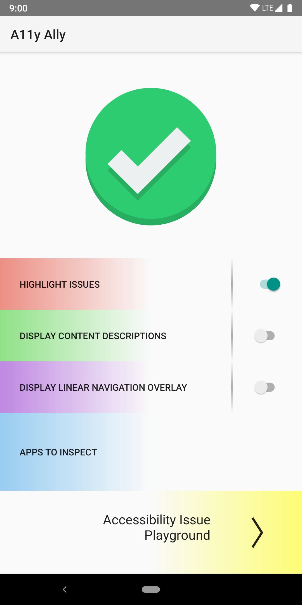
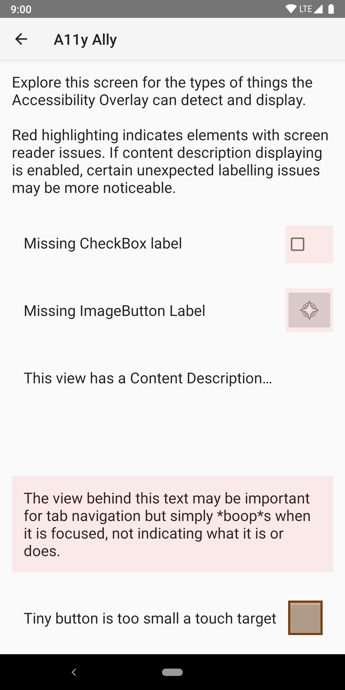

# A11y Ally [](https://play.google.com/store/apps/details?id=com.quittle.a11yally) [](https://travis-ci.com/quittle/a11y-ally)


A11y Ally (as in <a href="https://a11yproject.com/about/#what-does-the-term-a11y-mean">Accessibility Ally</a>)
tool is aimed at developers, designers, and testers to analyze and inspect Android applications'
accessibility to all users. Providing an AR-style overlay, it runs alongside your app and highlights
issues it discovers and provides insight into what assistive technology users experience when using
your app. In addition to providing exploratory feedback for a user manually interacting with their app,
A11y Ally can generate reports of accessibility issues it finds, making it possible to integrate into
automated testing.

**[Learn how to get started now!](GETTING_STARTED.md)**
<br />
<br />

| Main Screen | Highlighting Example |
| --- | --- |
|  |  |

> It currently only supports a small subset of intended functionality. Check the feature list below
or in the app to see what features are currently supported. If there's something missing you would
like, feel free to file an issue and I'll work on adding it.

## Features

### Filtering
* Select which apps to provide checks for
* Select what visual indicators to apply

### Visual Feedback
* Issue Highlighting - Highlights views in your app that have accessibility issues
  * Missing content descriptions
  * Clickable views with no text or content description, making them opaque buttons to screen readers
  * Clickable elements too small for all users to click.
* Content Description Labels - Overlay views with their `contentDescription`
* Linear Navigation - Covers the screen with a depiction of what users relying on Linear Navigation experience

### Reports
* Logging issues to [`logcat`](https://developer.android.com/studio/command-line/logcat)
* Logging issues to a file for analysis
* Toggling of logging via Android [Intents](https://developer.android.com/guide/components/intents-filters)

## Coming One Day
* Investigate checking color-issues
  * Color-blind friendliness
  * High text to background contrast
* See [issues](https://github.com/quittle/a11y-ally/issues) for more and request what you'd like to see!

## Usage

To get started, open the app and press the yellow, exclamation point button, following the prompts to
grant the app its required permissions. Once set up, ensure the check mark at the top is green and turned on.
Use the toggles to enable different feature sets and click on the buttons to their left to change their
settings. Once set up, you can preview the overlay experience by tapping the **Preview Accessibility Overlay**
button at the bottom.

To enable logging to `logcat`and a file, you can send intents to the
`com.quittle.a11yally.RecordingService`. To do so, you must have the custom permission
`com.quittle.a11yally.MANAGE_RECORDING`. This is to prevent malicious apps from making recordings and
attempting to find sensitive data revealed to A11y Ally. The intents currently supported are

* `com.quittle.a11yally.START_RECORDING` - Starts a recording session
* `com.quittle.a11yally.STOP_RECORDING` - Stops a recording session

To toggle via ADB, you can use the following commands

```sh
$ adb shell run-as com.quittle.a11yally am startservice \
    -n "com.quittle.a11yally/.RecordingService" \
    -a "com.quittle.a11yally.START_RECORDING" \
    --user 0
$ adb shell run-as com.quittle.a11yally am startservice \
    -n "com.quittle.a11yally/.RecordingService" \
    -a "com.quittle.a11yally.STOP_RECORDING" \
    --user 0
```

Once recording is stopped, the app will print out the location of the recording file that you can
retrieve. To read it, you will need to again run as the app's user. Below shows one way you could
read the file. Note that the exact location may vary between devices.

```sh
$ adb shell run-as com.quittle.a11yally cat \
    /data/user/0/com.quittle.a11yally/files/recordings/recording.json
```

In order to simplify the permission's configuration necessary for a user to toggle from the
commandline, A11y Ally grants itself permission to perform these actions. You can then run as the
app's user (`com.quittle.a11yally` and `--user 0`) to start the service.
